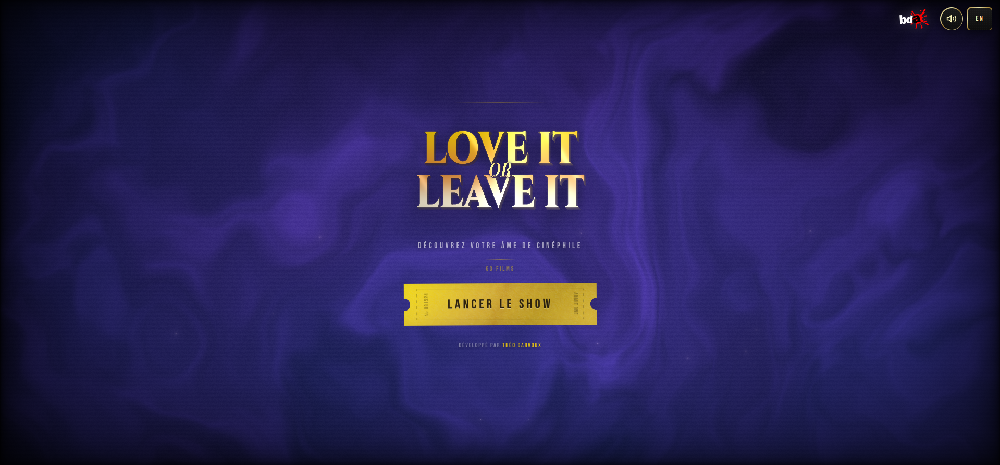

# 🎬 Love It Or Leave It - Votre Âme de Cinéphile



**Love It Or Leave It** est une petite expérience interactive conçue pour les amoureux du septième art. Le concept est simple : on vous présente une sélection de films cultes, et c'est à vous de trancher. Vous aimez ? Vous détestez ? Ou vous ne connaissez pas encore ce classique ?

À la fin du show, l'algorithme analyse vos goûts pour vous révéler votre véritable profil de cinéphile. Êtes-vous un "Héros d'Action", une "Légende de la Comédie" ou peut-être un "Pionnier de la SF" ?

---

## Le Concept

L'idée, c'est de retrouver le plaisir du "swipe" appliqué au cinéma. 
- **Swipe à droite** : Vous adorez (Love It).
- **Swipe à gauche** : Ce n'est pas pour vous (Leave It).
- **Swipe en haut** : Vous ne l'avez pas encore vu (Connais pas).

Une fois les 63 films passés en revue, vous obtenez un profil détaillé basé sur vos genres de prédilection, avec la possibilité de télécharger votre carte de résultat ou de la partager.

## Coulisses Techniques

C'est un projet moderne qui mélange performance et esthétique :

- **Frontend** : [React 19](https://react.dev/) + [Vite](https://vitejs.dev/) pour la rapidité.
- **3D & Effets** : Utilisation de [Three.js](https://threejs.org/) via [React Three Fiber](https://r3f.docs.pmnd.rs/) pour les titres stylisés et le fond immersif.
- **Shaders** : Des shaders personnalisés (GLSL) pour donner cette ambiance "fumée" et dorée.
- **Animations** : Un mélange de [Framer Motion](https://www.framer.com/motion/) et [GSAP](https://gsap.com/) pour des transitions fluides.
- **Audio** : Gestion du son avec [Howler.js](https://howlerjs.com/).
- **Multilingue** : Entièrement traduit en Français et Anglais via `i18next`.

---

## Lancer le projet

### En local (Node.js)

Si vous voulez bidouiller le code ou tester en local :

1. Installez les dépendances :
   ```bash
   npm install
   ```

2. Lancez le serveur de développement :
   ```bash
   npm run dev
   ```

3. Ouvrez votre navigateur sur `http://localhost:5173`.

### Avec Docker

Pour une installation propre en un clin d'œil :

```bash
docker-compose up -d --build
```

---

## Crédits

Développé par **Théo Darvoux** pour la campagne **BDA** de Télécom SudParis.

---
*Alors, prêt à lancer le show ?*
